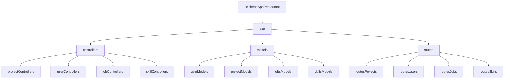
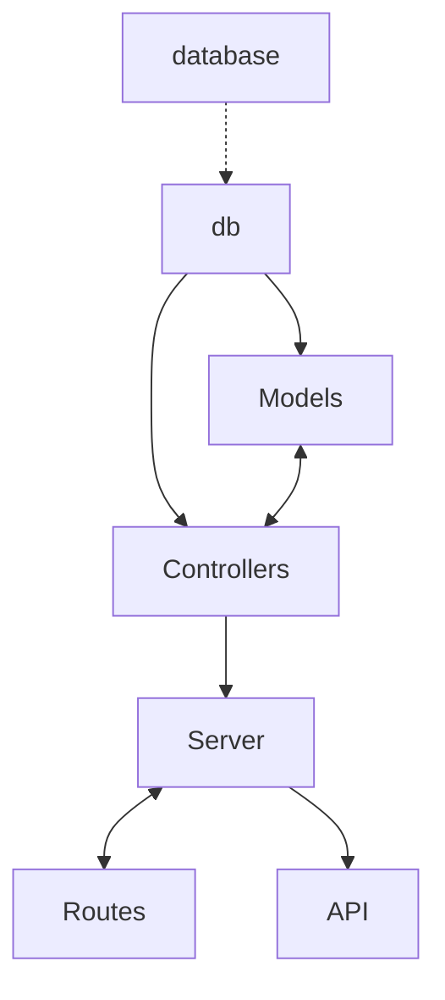

# Web Server - BackendPortfolio by OmarVentura.

## Tabla de Contenidos
1. [Requerimentos](#id1)
2. [Creación del proyecto](#id2)
3. [Dependencias usadas crear el proyecto](#id3)
4. [Estructura de directorio de App](#id4)
5. [Carpetas `app`](#id5)
6. [Diseño de todos los componentes de la app](#id8)
7. [Archivo app.js y funcionalidad](#id9)
8. [Como clonar Repo y correrlo de manera local](#id11)

## Requerimentos<a name="id1"></a>

1. Endpoints para Usuarios.
2. Endpoints para Proyectos.
3. Endpoints para Skills.
4. Endpoints para Experiencia.

## Creación del proyecto<a name="id2"></a>
```
Backend Portfolio
```

## Dependencias usadas crear el proyecto<a name="id3"></a>

 - `Cors 2.8.5`:  Dependencia CORS utilizado para validar el correcto funcionamiento de los diferentes módulos en la aplicación, se inicia con el `npm install --save-dev cors` y se añade al `package.json` los scripts necesarios.
   * <a href="https://jestjs.io/es-ES/docs/next/getting-started" > Documentación `CORS`</a>
 - `Express 4.18.2`: Express lo utilizamos para crear la aplicación y poder correrla en el entorno NODE.JS con un servidor web para integrar nuestros módulos y que sean funcionales.
   * <a href="https://devdocs.io/express/starter/installing" > Documentación `Express`</a>
 - `pg 8.11.3`:  Para la base de datos ocupamos PostgreSQL.
   * <a href="https://www.postgresql.org/docs/" > Documentación `PostgreSQL`</a>
 - `sequelize 6.35.2`:  Para la conexión a la Base de Datos se utilizó SEQUELIZE y así poder conectarse a PostgreSQL.
   * <a href="https://sequelize.org/docs/v6/getting-started/" > Documentación `SEQUELIZE`</a>

## Estructura de directorio de App<a name="id4"></a>


Separamos los directorios para tener una estructura, separar las responsabilidades, los cuales estructuramos de la siguiente forma:

#### Carpetas `app`<a name="id5"></a>

- Carpeta `models`: Se crearon los archivos `projectsModels`, `jobsModels`, `skillsModels` y `userModels` en el cual se crea una constante para Proyectos, Experiencias, Skills y Usuarios, importando la conexión a la Base de Datos, alli creamos tipos para SEQUELIZE para la BD.

- Carpeta `controllers`: Aquí tenemos los archivos `projectControllers`, `jobControllers`, `skillControllers` y `userControllers` que importa la información recibida en los Models, de allí exporta los endpoints para su uso.

- Carpeta `database`: En esta carpeta tenemos un archivo de conexión a la Base de Datos con SEQUELIZE.

- Carpeta `routes`: En esta carpeta tenemos un archivo de rutas, en la cual se incluyen todas las rutas de accesos a las diferentes endpoints de la aplicación.

### Diseño de todos los componentes de la app<a name="id8"></a>


### Archivo `app.js`<a name="id9"></a>
    - En el archivo se crea el servidor con Express, en el cual se crean los endpoints para los diferentes requerimientos.

#### Funcionalidad:

| Request | Link | Response |
|---|---|---|
| `https://backend-portfolio-u7k6.onrender.com/user` | <a href="https://backend-portfolio-u7k6.onrender.com/user" target="_blank"> `Usuarios`</a> | Se obtiene la lista de los Usuarios |
| `https://backend-portfolio-u7k6.onrender.com/jobs` | <a href="https://backend-portfolio-u7k6.onrender.com/jobs" target="_blank"> `Experiencia`</a> | Se obtiene la lista de la Experiencia |
| `https://backend-portfolio-u7k6.onrender.com/skills` | <a href="https://backend-portfolio-u7k6.onrender.com/skills" target="_blank"> `Skills`</a> | Se obtiene la lista de las Skills |
| `https://backend-portfolio-u7k6.onrender.com/projects` | <a href="https://backend-portfolio-u7k6.onrender.com/projects" target="_blank"> `Proyectos`</a> | Se obtiene la lista de los Proyectos |

## Como clonar Repo y correrlo de manera local<a name="id11"></a>
* Primero debes ubicarte en la página principal del repositorio <a href="https://github.com/OmarVenturaP/backend-portfolio">BackendPortfolio</a>.
* Al estar en la página principal del Repositorio debes ubicarte en Clone y copiar el link de acceso al repo.

* Posteriormente debes abrir la linea de comandos Git Bash e ingresar el comando y el link al repo
```
git clone https://github.com/OmarVenturaP/backend-portfolio
```
* Una vez clonado el repo de manera local, debes instalar las dependencias necesarias dentro de este proyecto, para ello ejecuta:
```
npm install
```
* Posteriormente ejecuta el servidor para validar su correcto funcionamiento. Recuerda que para poder trabajar con el proyecto, debes tener una conexión a la base de datos. Una vez ingresas datos de conexión podrás correr el proyecto con el siguiente comando en terminal.
```
node app.js
o
npm start
```
  Si quieres usar el proyecto con un archivo .env, para correrlo en entorno de desarrollo, debes ejecutar el comando
```
node --env-file=.env app.js
```
<hr>
